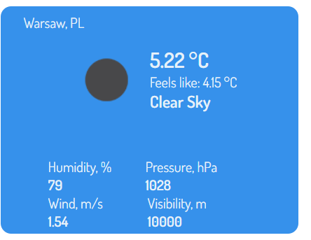

A small aplication I made for my TypeScript practice.

Chrome extensions which fetches user's IP and shows widget with current weather for the user's location.

The extension uses [ipapi API](https://ipapi.co) (to fetch user's IP) and [OpenWeather API](https://openweathermap.org/) to get current weather.

After receiving the data the extension display the weather and changes widget's colour based on weather condition (rain, snow, clouds etc.).

Build folder - folder for uploading as a Chrome extension.
